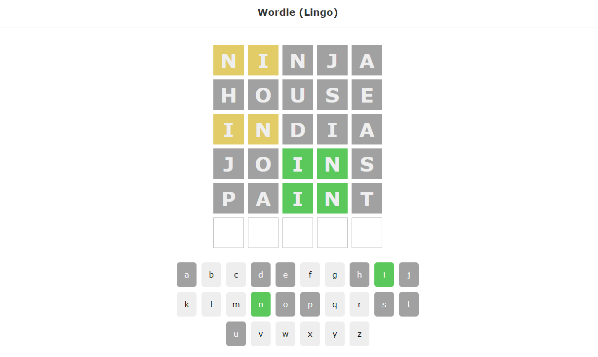

# Wordle (game)
This project is a re-creation of the popular web app/game "Wordle".
It was created by following [this tutorial video series](https://www.youtube.com/playlist?list=PL4cUxeGkcC9gXdVXVJBmHpSI7zCEcjLUX) by The Net Ninja



## Technologies Used

* React
* JavaScript
* NPM
* HTML
* CSS
* JSON Server
* API call

## Description
The purpose of building out the game is to learn about/practice using Hooks within a React application.

## The Game
The goal of this game is for the user to guess the hidden 5 letter word.
The User has 6 chances to guess the word.
If a letter in the guessed word is in the solution word and in the correct position, it will turn Green.
If a letter in the guesses word is in the solution word, but in the wrong position, it will turn Yellow.
If a letter in the guessed word is not in the solution word it will turn Grey.

## Setup/Installation Requirements
* _Go to [GitHub](https://github.com/AaronDBoyd/Wordle-React.git)_
* _Clone git repository to local machine_
```
$ git clone https://github.com/AaronDBoyd/Wordle-React.git
```
* _Navigate to root folder and open directory in your terminal_

#### Build Environment
* _Install packages:_
```
$ npm install
```

#### Server:
* _Start server:_
```
$ npm start
```

## Known Bugs

* No known bugs.
